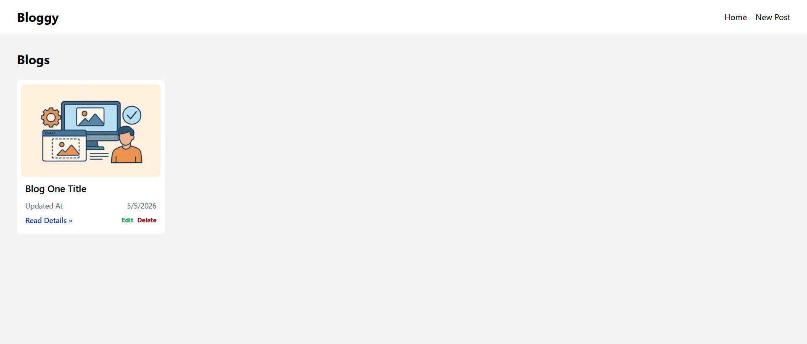
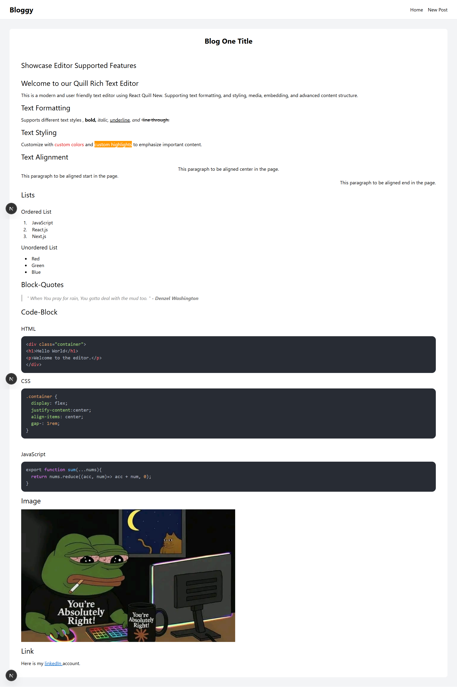
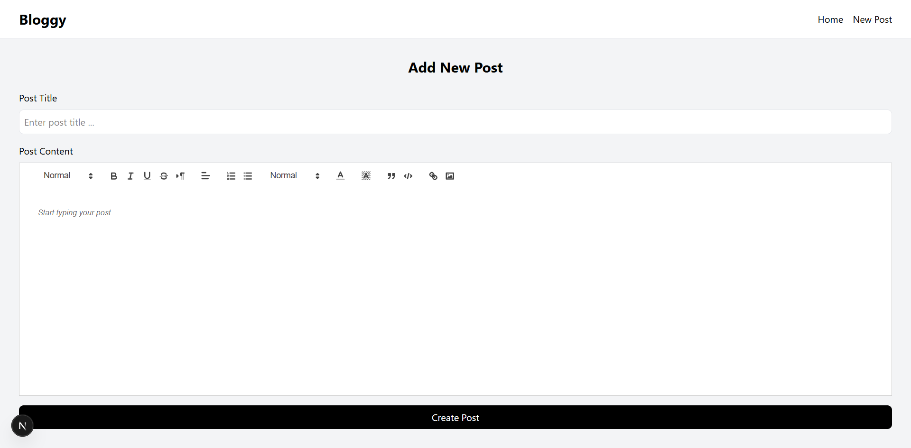

# Bloggy — Minimal CMS

A minimal content management system built with Next.js 16, React Hook Form, React Quill , and highlight.js. Create, edit, preview, and delete blog posts with a rich text editor — all persisted in localStorage.

---

## Features

- **Rich text editing** — powered by React Quill New with full toolbar support (headings, bold, italic, alignment, lists, blockquote, code block, links, images)
- **Live autosave** — content persists to localStorage as you type, so you never lose a draft
- **Post management** — full CRUD: create, read, update, and delete posts
- **Consistent rendering** — editor and preview share the same styles so what you write is what readers see
- **Syntax highlighting** — code blocks are highlighted via highlight.js with auto language detection
- **Responsive** — works across desktop and mobile

---

## Screenshots

### Home Page



### Post Details Page



### Post form



---

## Tech Stack

| Layer               | Tool                    |
| ------------------- | ----------------------- |
| Framework           | Next.js 16 (App Router) |
| Language            | TypeScript              |
| Editor              | React Quill New         |
| Forms               | React Hook Form         |
| Styling             | Tailwind CSS            |
| Syntax highlighting | highlight.js            |
| Persistence         | localStorage            |

---

## Project Structure

```
├── app/                        # Next.js App Router — routing only
│   ├── post/
│   │   ├── [postId]/
│   │   │   ├── update/         # Edit post page
│   │   │   └── page.tsx        # Post detail page
│   │   └── new/                # Create post page
│   ├── globals.css
│   ├── layout.tsx
│   └── page.tsx                # Posts list (home)
│
├── features/                   # Feature-based modules
│   ├── editor/                 # Rich text editor feature
│   │   ├── components/         # Editor UI components (toolbar, editor area)
│   │   ├── hooks/              # useEditor hook
│   │   └── index.ts            # Barrel exports
│   │
│   └── posts/
│       ├── components/         # PostForm, PostCard, PostPreview
│       ├── hooks/              # usePostForm, usePosts
│       ├── services/           # CRUD functions (localStorage layer)
│       ├── types/              # Post type definitions
│       └── index.ts            # Barrel exports
│
└── shared/                     # App-wide reusable code
    ├── ui/                     # Reusable components (Editor, Button, etc.)
    ├── hooks/                  # Reusable hooks
    └── config/
        └── navigation.ts       # NavLink interface + nav links array
```

---

## Data Model

Every post stored in localStorage follows this shape:

```ts
export interface Post {
  id: string;
  title: string;
  content: string;
  createdAt: Date | string;
  updatedAt: Date | string | null;
}
```

All posts are stored under a single localStorage key `"posts"` as a JSON array.

---

## Getting Started

**Prerequisites:** Node.js v22.13.0+

**1. Clone the repository**

```bash
git clone https://github.com/Ebram-Barsoum/Next.js-Minimal-CMS.git
cd Next.js-Minimal-CMS
```

**2. Install dependencies**

```bash
npm install
```

**3. Start the development server**

```bash
npm run dev
```

**4. Open your browser**

```
http://localhost:3000
```

No environment variables or database setup required — the app runs entirely in the browser.

---
